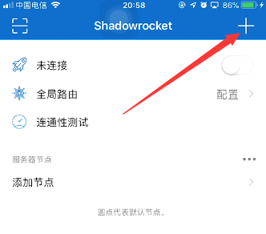

 [toc] 

# 电脑 windows 客户端

## 客户端下载

以下链接提供 Clash for Windows 0.20.0 中文版 的安装包

1.  国内蓝奏云下载地址 -> [点击下载](https://dogcloud.lanzout.com/ipw3Z0v68mpi)
2.  国内蓝奏云下载地址【备用】 -> [点击下载](https://dogcloud.lanzoux.com/ipw3Z0v68mpi)
3.  官方Github下载地址 -> [点击下载](https://github.com/Fndroid/clash_for_windows_pkg/releases/download/0.20.0/Clash.for.Windows-0.20.0-win.7z)  
    更多版本请前往官方github发布页下载 -> [点击前往](https://github.com/Fndroid/clash_for_windows_pkg/releases)

## 订阅

1.   复制订阅链接  
2.  打开 Clash 客户端的  配置（profiles）   栏，将刚刚复制的地址粘贴到  地址栏   中点击  下载（download）   ，此时 Clash 客户端中会出现 订阅文件  。  
    

## 开启代理

开启系统代理

1.  在 Clash 客户端的  主页（general）   栏中，找到并打开  系统代理（system proxy）  选项。
  
3\. 选择 规则/rule   模式  

# 苹果/iPhone使用教程
## 客户端下载
使用苹果美区账号下载 Shadowrocket 。
## 订阅节点
1.  复制订阅链接  
2. Shadowrocket  首页   ，点击右上角的 ➕ -> 

3. 粘贴订阅地址。

## 开启代理
 Shadowrocket 首页 ，点击右上角连接开关。

# 安卓/Android使用教程
## 客户端下载
以下链接提供 Clash for Android 2.5.4 premium 中文版 的安装包

1. 国内蓝奏云下载地址 -> [点击下载](https://dogcloud.lanzout.com/iOnSm0u3au0j)
4. 官方Github下载地址 -> [点击下载](https://github.com/Kr328/ClashForAndroid/releases/download/v2.5.4/cfa-2.5.4-premium-universal-release.apk)
5. 更多版本请前往官方github发布页下载 -> [点击前往](https://github.com/Kr328/ClashForAndroid/releases)

## 订阅
1.  复制订阅链接  
2.  Clash 客户端  配置   栏，点击右上角 ➕ 然后选择  url   选项。

3. 名称 随意填写 ，将刚刚复制的订阅地址粘贴到  url  处，点击右上角  保存  按钮。

4.单击选中配置文件使其生效。

## 开启代理
1. 回到主界面，点此启动 即可开始代理。
